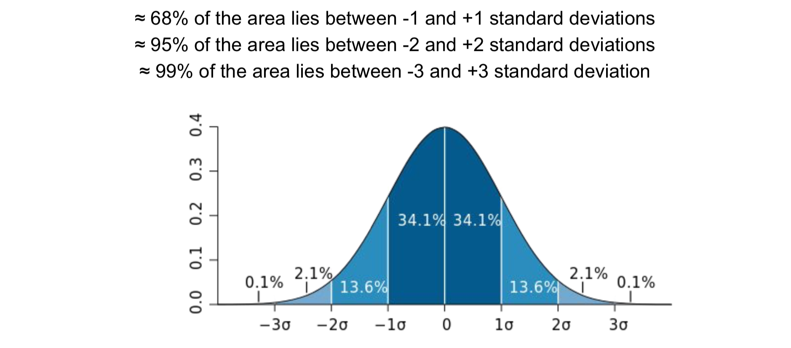
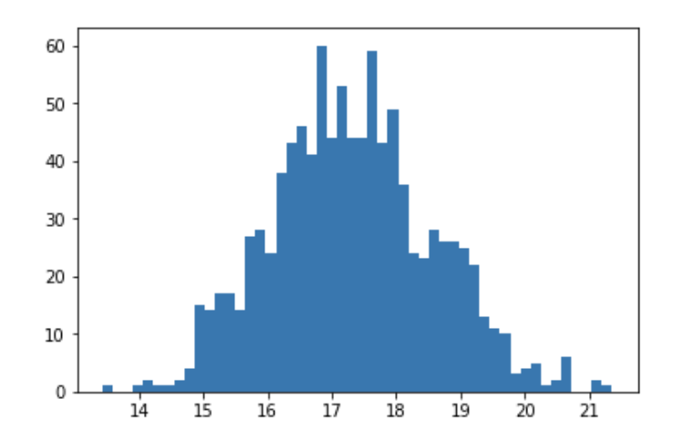
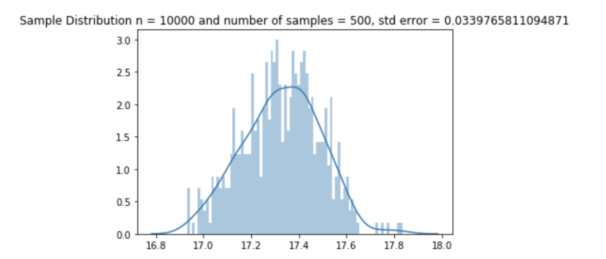
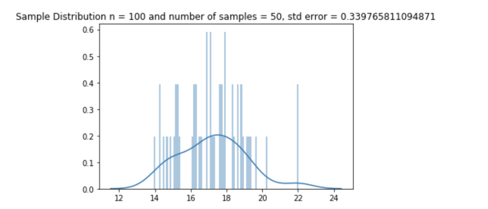

# Sampling

## Population Inference

The mayor's office has hired Flatiron Data Science Immersive students to determine a way to fix traffic congestion. A good starting point is to determine out what proportion of the population of Seattle owns a car.

In order for us to make any determinations about a population, we must first get information about it.

Because it's impractical to ever usually get data about *everyone* in a population, we must take a sample.


What do we want our sample to look like?

In particular, what relationship do we want between the sample and the population? What steps can we take to improve our odds of success in achieving this?


**Random sampling is not easy to do. Let's look at an example:**

Imagine you are trying to determine what proportion of DC metro area people own a car.

Here are two strategies we might employ:

* Stand outside of Flatiron at 12 pm and ask random people until *n* responses


* Go to a randomly assigned street corner and at a random time and ask *n* people if they own a car

Which strikes you as better?

When we gather a sample, we are trying to minimize the bias of our sample while also minimizing our cost.

##### Population v Sample Terminology
Characteristics of populations are called *parameters*

Characteristics of a sample are called *statistics*


So, we decide on an appropriate manner to collect the sample (more to come in power and effect), collect it, then calculate a sample statistic. 

Let's simulate this with code.  

Let's create a population of systolic blood pressure of adult males in Chicago, assuming a mean of 114 with a standard deviation of 11.  We will also assume the adult male population to be 1.5 million. 


```python
import numpy as np
import seaborn as sns
import matplotlib.pyplot as plt

pop = int(1.5*10**6)
sys_pop = np.random.normal(114, 11, pop)

fig, ax = plt.subplots()

sns.kdeplot(sys_pop, ax=ax)
ax.set_title('Adult Male Systolic Blood Pressure')
ax.set_xlabel('Systolic BP')
```


    Text(0.5, 0, 'Systolic BP')


We randomly sample 50 men from this population, resulting in the following sample.


```python
sample = np.random.choice(sys_pop, 50)
```

We can then calculate sample statistics.


```python
print(f'Sample mean: {sample.mean()}')
print(f'Sample standard deviation: {sample.std()}')
print(f'Sample median: {np.median(sample)}')
```

    Sample mean: 117.32143521266951
    Sample standard deviation: 9.93574629444601
    Sample median: 118.24184711253844


If we repeated this process, taking samples of the population repeatedly, we would get an array of sample statistics.


```python
number_of_samples = 1000
sample_size = 50
sample_stats = []
for _ in range(number_of_samples):
    sample = np.random.choice(sys_pop, sample_size)
    # collect the mean of each of the 1000 samples in sample stats
    sample_stats.append(sample.mean())

```

The collection of sample stats represents our __sampling distribution__


```python
fig, ax = plt.subplots()
ax.hist(sorted(sample_stats), bins=20)
ax.set_title('Sampling Distribution\n of Systolic BP')
ax.set_xlabel("Systolic Blood Pressure")
ax.set_ylabel('Count');
```


## Group Exercise

Below, we have four different sample scenarios.  Each group will code out the following: 

You are given a "population" to sample from based on the type of distribution.

1. Take a random sample of size n, where n > 30, from the population and calculate the mean of that population.

2. Repeat the sample n numbers of times (n = 1000). 

3. Plot the sampling distribution

## Group 1:

A bowler on the PBA rolls a strike 60% of the time. The population strikes of all games ever bowled is stored in in the population variable below.


```python
population = np.random.binomial(12, .6, 10000)
fig, ax = plt.subplots()
ax.bar(range(0,12), np.unique(population, return_counts=True)[1])
ax.set_title('Strikes Per Game')
```


    Text(0.5, 1.0, 'Strikes Per Game')


```python
#__SOLUTION__

sample_means = []
for n in range(1000):
    sample = np.random.choice(population, 50)
    sample_means.append(sample.mean())
    
fig, ax = plt.subplots()
ax.hist(sample_means, bins = 20)
```


    (array([  1.,   5.,  15.,  22.,  45.,  73.,  72., 113., 120., 140., 111.,
            103.,  77.,  40.,  35.,  18.,   2.,   5.,   2.,   1.]),
     array([6.5  , 6.577, 6.654, 6.731, 6.808, 6.885, 6.962, 7.039, 7.116,
            7.193, 7.27 , 7.347, 7.424, 7.501, 7.578, 7.655, 7.732, 7.809,
            7.886, 7.963, 8.04 ]),
     <a list of 20 Patch objects>)


## Group 2:

Stored in the variable below is the number of pieces of mail that arrive per week at your door for each of the 4500 weeks in your life.  


```python
mail_population = np.random.poisson(3, 4500)
counts = np.unique(mail_population, return_counts=True)

fig, ax = plt.subplots()
ax.bar(np.unique(counts[0]), counts[1])
ax.set_title('Distribution of Pieces of Mail/Week')
ax.set_xlabel("Pieces of Mail")
```


    Text(0.5, 0, 'Pieces of Mail')


```python
#__SOLUTION__

sample_means = []
for n in range(1000):
    sample = np.random.choice(mail_population, 50)
    sample_means.append(sample.mean())
    
fig, ax = plt.subplots()
ax.hist(sample_means, bins = 30)
ax.set_title('Sample Means of Pieces of Mail\n Arriving at your door')
ax.set_xlabel('Number of pieces of mail')
```


    Text(0.5, 0, 'Number of pieces of mail')


# Group 3 

The population data for the number of minutes between customers arriving in a Piggly Wiggly is stored in the variable piggly_population.


```python
# on average, 20 customers enter per hour
piggly_population = np.random.exponential(1/(20/60), size=10000)
fig, ax = plt.subplots()
ax.hist(piggly_population, bins = 50, normed=True)
ax.set_title('Sample Means of Time Between Piggle Wiggly Customers')
ax.set_xlabel('Minutes');
```

    /Users/johnmaxbarry/.local/lib/python3.7/site-packages/ipykernel_launcher.py:4: MatplotlibDeprecationWarning: 
    The 'normed' kwarg was deprecated in Matplotlib 2.1 and will be removed in 3.1. Use 'density' instead.
      after removing the cwd from sys.path.


```python
#__SOLUTION__

sample_means = []
for n in range(1000):
    sample = np.random.choice(piggly_population, 50)
    sample_means.append(sample.mean())
    
fig, ax = plt.subplots()
ax.hist(sample_means, bins = 30);
ax.set_title("""Sample means of number of minutes\n between people entering a Piggly Wiggly""")
ax.set_xlabel("Number of minutes between customers")
```


    Text(0.5, 0, 'Number of minutes between customers')


## Central Limit Theorem

If we take repeated samples of a population, the sampling distribution of sample means will approximate to a normal distribution, no matter the underlying distribution!

## $E(\bar{x_{n}}) = \mu$

as n --> "large"

[good D3 example](https://seeing-theory.brown.edu/probability-distributions/index.html)

[good video demonstration](https://www.youtube.com/watch?v=jvoxEYmQHNM)


Let's look at an example taken from the ubiquitous Iris dataset. This histogram represents the distributions of sepal length:


https://www.kaggle.com/tentotheminus9/central-limit-theorem-animation

As we will see in hypothesis testing, pairing this theorem with the Empirical rule will be very powerful.




Knowing that any sampling distribtion, no matter the underlying population distribution, will approach normality, we will be able to judge, given the empirical rule, how rare a given sample statistic is.  

### An Example
A bicycle advocacy group has come to us to see if it would make sense to increase the length of time users of Capital Bike Share have to ride on their bikes before they have to return them. Let's analyze a collection of Capital Bike Share data to determine if we should lengthen the time people have with their bikes.

Let's head over [here](https://s3.amazonaws.com/capitalbikeshare-data/index.html) for some DC bike data!


```python
import pandas as pd
import numpy as np
import matplotlib.pyplot as plt
import requests
%matplotlib inline

```


```python
! wget 'https://s3.amazonaws.com/capitalbikeshare-data/202003-capitalbikeshare-tripdata.zip' -O temp.zip
! unzip temp.zip
```

    --2020-05-25 14:36:08--  https://s3.amazonaws.com/capitalbikeshare-data/202003-capitalbikeshare-tripdata.zip
    Resolving s3.amazonaws.com... 52.216.101.61
    Connecting to s3.amazonaws.com|52.216.101.61|:443... connected.
    HTTP request sent, awaiting response... 200 OK
    Length: 3835293 (3.7M) [application/zip]
    Saving to: 'temp.zip'
    
    temp.zip            100%[===================>]   3.66M  4.32MB/s    in 0.8s    
    
    2020-05-25 14:36:09 (4.32 MB/s) - 'temp.zip' saved [3835293/3835293]
    
    Archive:  temp.zip
      inflating: 202003-capitalbikeshare-tripdata.csv  


```python

```


```python
df = pd.read_csv('202003-capitalbikeshare-tripdata.csv')
```


```python
df.tail()
```


<div>
<style scoped>
    .dataframe tbody tr th:only-of-type {
        vertical-align: middle;
    }

    .dataframe tbody tr th {
        vertical-align: top;
    }

    .dataframe thead th {
        text-align: right;
    }
</style>
<table border="1" class="dataframe">
  <thead>
    <tr style="text-align: right;">
      <th></th>
      <th>Duration</th>
      <th>Start date</th>
      <th>End date</th>
      <th>Start station number</th>
      <th>Start station</th>
      <th>End station number</th>
      <th>End station</th>
      <th>Bike number</th>
      <th>Member type</th>
    </tr>
  </thead>
  <tbody>
    <tr>
      <th>162525</th>
      <td>673</td>
      <td>2020-03-31 23:17:58</td>
      <td>2020-03-31 23:29:12</td>
      <td>31235</td>
      <td>19th St &amp; Constitution Ave NW</td>
      <td>31265</td>
      <td>5th St &amp; Massachusetts Ave NW</td>
      <td>W22920</td>
      <td>Member</td>
    </tr>
    <tr>
      <th>162526</th>
      <td>514</td>
      <td>2020-03-31 23:18:13</td>
      <td>2020-03-31 23:26:47</td>
      <td>31203</td>
      <td>14th &amp; Rhode Island Ave NW</td>
      <td>31324</td>
      <td>18th &amp; New Hampshire Ave NW</td>
      <td>21054</td>
      <td>Member</td>
    </tr>
    <tr>
      <th>162527</th>
      <td>1524</td>
      <td>2020-03-31 23:29:00</td>
      <td>2020-03-31 23:54:25</td>
      <td>31110</td>
      <td>20th St &amp; Florida Ave NW</td>
      <td>31403</td>
      <td>5th &amp; Kennedy St NW</td>
      <td>W24341</td>
      <td>Member</td>
    </tr>
    <tr>
      <th>162528</th>
      <td>565</td>
      <td>2020-03-31 23:41:17</td>
      <td>2020-03-31 23:50:43</td>
      <td>31603</td>
      <td>1st &amp; M St NE</td>
      <td>31256</td>
      <td>10th &amp; E St NW</td>
      <td>W22691</td>
      <td>Member</td>
    </tr>
    <tr>
      <th>162529</th>
      <td>1054</td>
      <td>2020-03-31 23:45:05</td>
      <td>2020-04-01 00:02:40</td>
      <td>31325</td>
      <td>Reservoir Rd &amp; 38th St NW</td>
      <td>31214</td>
      <td>17th &amp; Corcoran St NW</td>
      <td>W24051</td>
      <td>Member</td>
    </tr>
  </tbody>
</table>
</div>


```python
trip_durations = df['Duration'] / 60
trip_durations_2hr = trip_durations[trip_durations < 2*60]
```

#### The length of a bike ride

What shape do you expect the distribution of trip durations to have?

#### Get population statistics


```python
trip_durations_2hr.hist(bins=100);
```


```python
trip_durations_2hr.median()
```


    12.083333333333334


Let's treat the whole dataset as our population.


```python
pop_mean = trip_durations.mean()
pop_std = trip_durations.std()
print(f'pop_mean is {pop_mean} \npop_std is {pop_std}')
```

    pop_mean is 18.978877745646678 
    pop_std is 36.47173596361402


#### When we take multiple samples from the distribution, and plot the means of each sample, the shape of the curve shifts.



#### The number of samples drives the shape of the curve more than the sample size itself



**Fewer samples**


### Let's confirm with code ourselves!


```python
def one_sample_mean(population):
    sample = np.random.choice(population, size=200, replace=True)
    return sample.mean()
```


```python
one_sample_mean(trip_durations_2hr)
```


    18.519333333333336


```python
d = [one_sample_mean(trip_durations) for i in range(1000)]
plt.hist(d, bins=50);
```


```python
import seaborn as sns

def central_limit_theorem_plotter(distribution, sample_size, num_samples):
    sample_means = np.zeros(num_samples)
    for idx, num in enumerate(range(num_samples)):
        sample = np.random.choice(distribution, size=sample_size, replace=True)
        sample_means[idx] = sample.mean()
    sns.distplot(sample_means, bins=80, kde=True)
    title = f'Sample Distribution n = {sample_size} and number of samples = {num_samples},\
    std error = {pop_std / num_samples}'
    print(f'mean = {sample_means.mean()}')
    plt.title(title)
```


```python
central_limit_theorem_plotter(trip_durations, 10000, 500);
```

    mean = 18.96967568


```python
central_limit_theorem_plotter(trip_durations, 100, 50);
```

    mean = 18.362706666666664


* What happens as we increase the sample size?
* How does the height of the distribution change? Why does it change?

### Show with exponential


```python
exponential = np.random.exponential(scale= 1, size=1000)
```


```python
plt.hist(exponential, bins=50);
```


```python
central_limit_theorem_plotter(exponential, 4000, 10000)
```

    mean = 1.0663546365385943


### Standard Error of the Mean

The standard error of the mean is the standard deviation of the sampling distribution.
The issue is that a sample is not an exact replica of the population. We need to account for that fact in order to make our estimate of the $\mu$ value possible. Let's break it down:

**Population sigma** <br/>

$\large\sigma _{x} = \frac{\sigma }{\sqrt{n}}$

* $ \sigma _{x}$ = standard error of $\bar{x} $
* $ \sigma $ = standard deviation of population

**What if we do not know the population sigma?**<br>
If we do not know the population standard deviation, we can approximate it by using the sample standard deviation.

$\large\sigma _{x} ≈ \frac{s}{\sqrt{n}}$

* s = sample standard deviation

**Sample size impact on standard error of mean**<br>

How should sample size influence standard error of the mean?

It will get *smaller* as sample size *increases*


Important implication: The Standard Error of the mean remains the same as long as the population standard deviation is known and sample size remains the same.


```python

```
